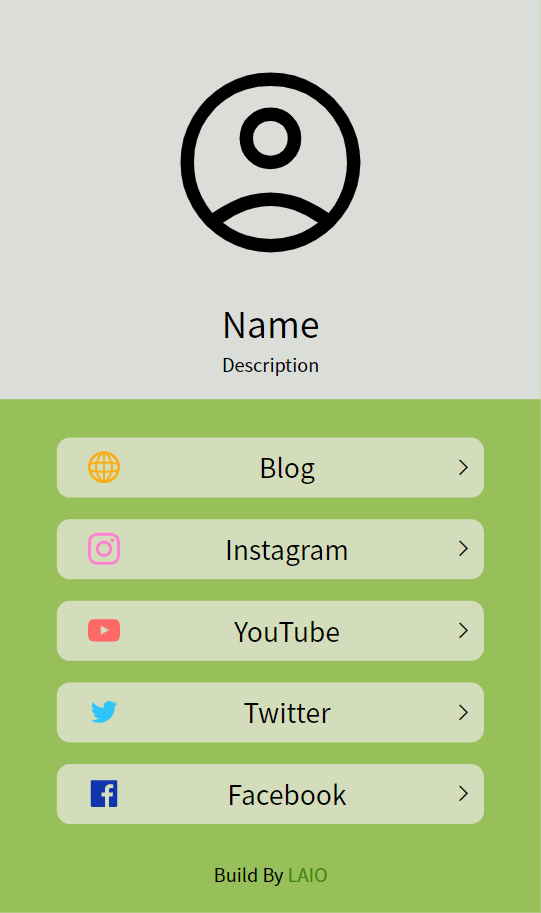

# LAIO

Links All In One (LAIO)



LAIO is a link-in-bio generator. With LAIO, we can create a static link-in-bio web page, generated by the Python package, Jinja2. The repository is written in Python, and you can modify the toml config file to create your own link-in-bio.

## Usage

1. Install Python Packages.
    ```bash
    pip3 install -r requirements.txt
    ```

2. Modify `config.toml`
    ```toml
    [render]
    template_folder = "templates"  # template folder
    build_folder = "build"         # build folder
    static_folder = "static"       # static files folder
    file = "main.html"             # template

    [parameter]
    icon = ""                    # icon for the web
    title = "Link-in-bio"        # web title
    avatar = "avatar.svg"        # your avatar
    name = "Name"                # your name
    description = "Description"  # your description
    footer = ""                  # footer 

    google_analytics = ""  # google analytics ID (G-XXXXXXXXXX)

    # blog link
    [[link]]
    icon = "blog.svg"  # icon for the link
    title = "Blog"     # title for the link
    url = ""           # url for the link

    # facebook link
    [[link]]
    icon = "facebook.svg"
    title = "Facebook"
    url = ""
    ```

3. Build the web
    ```bash
    python3 build.py
    # specify the config file
    python3 build.py -c config.toml
    ```

4. See the results, run `serve.py`
    ```bash
    python3 serve.py
    # specify the config file
    python3 serve.py -c config.toml
    # set the port
    python3 serve.py -p 8888
    ```

## Other

If you want to change the color, you can adjust the css file to whatever you want.
